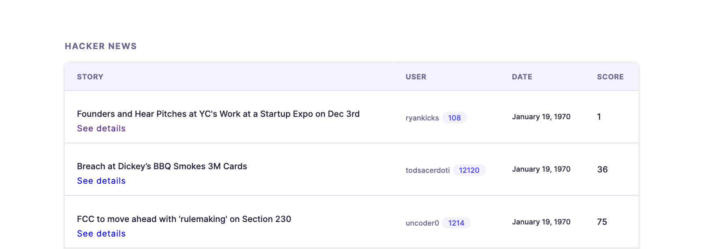

This project was made as a part of JavaScript Test Assignment.  
It displays a table with 10 random posts with corresponding info about post details and its author.  
Data was fetched from Hacker News Api (https://hacker-news.firebaseio.com/v0/topstories.json).

**The project was implemented using the following stack:**
- React
- TypeScript
- styled components

Mobile layout is also available.

**Screenshots:**

  

**You can clone the repository and run the project on your machine.** 
`npm start` - runs the app in the development mode.  
Open [http://localhost:3000](http://localhost:3000) to view it in the browser.
